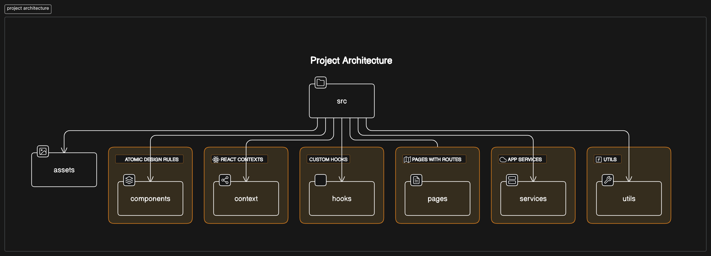

## Proyecto de React Organizado - Estructura

Este README describe la estructura y la arquitectura del proyecto de React. El proyecto sigue una estructura organizada en la carpeta `src`, con subcarpetas que cumplen diferentes propósitos.



### Estructura de Carpetas

```
src/
│
├── assets/         # Carpeta para assets (imágenes, fuentes, etc.)
│   ├── images/
│   └── fonts/
│
├── components/     # Carpeta para componentes React organizados según Atomic Design
│   ├── atoms/
│   ├── molecules/
│   ├── organisms/
│   ├── templates/
│   └── pages/
│
├── context/        # Carpeta para contextos de React
│
├── hooks/          # Carpeta para custom hooks de React
│
├── pages/          # Carpeta para componentes de página (components que tienen rutas)
│
├── services/       # Carpeta para servicios de la aplicación (API, etc.)
│
└── utils/          # Carpeta para funciones de utilidad (utilidades, helpers)
```

### Descripción de Carpetas

- **assets**: Contiene recursos estáticos como imágenes y fuentes que se utilizan en la aplicación.

- **components**: Organizado según el patrón de diseño Atomic Design, este directorio contiene los componentes de la aplicación. Está dividido en subcarpetas que representan diferentes niveles de complejidad de los componentes, desde átomos simples hasta páginas completas.

- **context**: Aquí se encuentran los contextos de React, que permiten compartir datos entre componentes sin necesidad de pasar props manualmente a través de cada nivel.

- **hooks**: Contiene los custom hooks de React, que encapsulan la lógica reutilizable de la aplicación.

- **pages**: Esta carpeta alberga los componentes de página que representan las diferentes rutas de la aplicación.

- **services**: Aquí se encuentran los servicios de la aplicación, como módulos de API para realizar solicitudes HTTP u otros servicios de backend.

- **utils**: Contiene funciones de utilidad que son comunes en toda la aplicación, como funciones de ayuda, utilidades matemáticas, de formato de fecha, etc.

### Notas Adicionales

- Mantener la organización de archivos y carpetas facilita la escalabilidad y el mantenimiento del proyecto.
  
- Se sigue un enfoque modular, lo que permite que diferentes partes de la aplicación sean desarrolladas, probadas y mantenidas de forma independiente.

- Se fomenta la reutilización de código a través de la separación de preocupaciones y la creación de componentes y funciones reutilizables.

- Se recomienda seguir las convenciones de nomenclatura y estructura establecidas para mantener la coherencia en todo el proyecto.